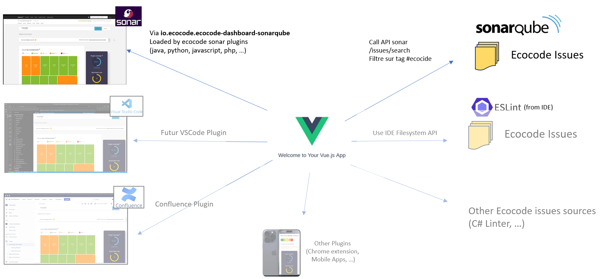
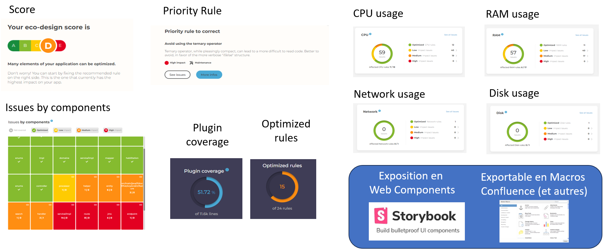

# Creedengo-Dashboard

This project is meant to provide Sustainable Code Dashboards to

- show potential impact on sustainability of unffollowed recommendations
- help decisions regarding code enhancement priorisation 
- and even potentially prevent new issues to be pushed to production

## Open Architecture

This project starts as a Vue.js application

- made available as a Sonarqube extension page
- related to the sonar inspected project using the sonarqube web APIs

Still, the code is structured to remain product agnostic

- allowing dashboards to be integrated in other contexts like
  - IDE addons for developers (VSCode, WebStorm, Visual Studio, Android Studio, X-Code, ...)
  - CI Pull/Merge Requests (Bitbucket, Github, Gitlab, Azure Devops, Gerrit, ...)
  - Project Wikis for decision makers (Confluence, Github/Gitlab, Teams/Sharepoint, Azure Devops, ...)
  - Or even dedicated Apps/Webapps (iOS, Android, ...)
- allowing to retrieves issues from other sources than the sonarqube API like
  - Other Static code  analyses solutions (Github, Codacy, Qodana, ...)
  - Linter reports (ESLint, csslint, klint, speccy/spectral, PHPStan, pylint, sqlfluff, ...)

## Open and testable Widget Catalog

The Dashboard are constructed from widgets (web components) exposed to storybooks.

It allows:
- to individually develop, enhance and test those widgets (accessibility, behaviors, visual regression)
- to ultimately help having stable end-to-end tests with gherkin step-definitions provided by these components themselves
- to be able to provide on-demand dashboards or dedicated widgets in any end application contexts (ex: independant Confluence macros)

## Project Build and Start

Read the [CONTRIBUTING.md](./CONTRIBUTING.md) file to look how to start the project at its current state
