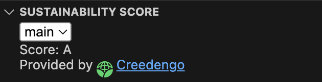

# Creedengo for Sonar

Sustainability Score based the on result of **Sonarqube** / **Sonarcloud** static code analyses. It mainly relies on issues detected by **Creedengo** (formerly known as **Ecocode**) for the [Green Code Initiative](https://green-code-initiative.org), and [Capgemini](https://www.capgemini.com) **Greensight** Sonar plugins

## Features

This extension provides a "Sustainability" panel in which it shows an  `A` to `E` "Eco Design Score" for the current project

This score is calculated from issues detected by Sonar with the following labels:

- **`creedengo`**: this tag should be added on sustainability rules introduced by the following Creedengo Sonar plugins:
  - [creedengo-csharp](https://github.com/green-code-initiative/creedengo-csharp)
  - [creedengo-ios](https://github.com/green-code-initiative/creedengo-ios)
  - [creedengo-java](https://github.com/green-code-initiative/creedengo-java)
  - [creedengo-javascript](https://github.com/green-code-initiative/creedengo-javascript)
  - [creedengo-php](https://github.com/green-code-initiative/creedengo-php)
  - [creedengo-python](https://github.com/green-code-initiative/creedengo-python)
  - [creedengo-rust](https://github.com/green-code-initiative/creedengo-rust)
- **`ecocode`**: this tag should be added on sustainability rules introduced by the following Ecocode Sonar plugins:
  - [ecoCode-android](https://github.com/green-code-initiative/ecoCode-android)
- **`greensight`**: this tag is added on sustainability rules introduced by the Capgemini Greensight Sonar plugin
- **`sustainability`**: this tag is applied on some natively supported Sonarqube & Sonarcloud rules (few are available at least for android projects)

> This panel shows up by default in the [SonarQube for IDE](https://marketplace.visualstudio.com/items?itemName=SonarSource.sonarlint-vscode) extension sidebar if it is installed.
> 
> Otherwise, it is made available from the main Explorer sidebar.
  
## Requirements

As of this version, this score requires

- Sonar connection settings (server URL & Authentication token)
- a `sonar-project.properties` file at the root folder of the project (to retrieve the idetifier of the Sonar project to inspect)

## Extension Settings

This extension contributes the following settings:

- `creedengo.sonarUrl`: URL of the Sonar Server.
- `creedengo.sonarToken`: Token generated from 'My Account > Security' in SonarQube Server".

## Known Issues

There is no remaining explicit message yet in the "Sustainability" panel when the extension is missing:

- connection settings from the configuration
- or an available `sonar-project.properties` file at the root of the project

## Release Notes

### 0.1.0

- Added the initial connection to sonnar + calculation of the score
